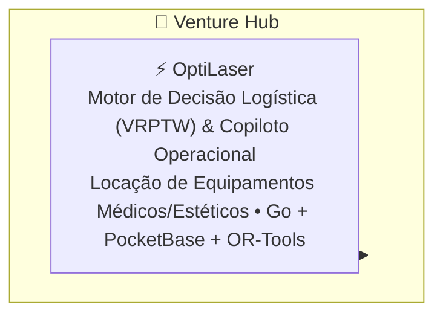

# 💼 Venture Hub

> **Orquestrador Federado de Produtos de Software, Startups & Motores de Decisão**<br />
> _O ecossistema de soluções de engenharia aplicada ao mercado de Gabriel Frigo._

<div align="center">

[](LICENSE)
[](https://go.dev)
[](https://developers.google.com/optimization)
[](https://pocketbase.io)
[](https://github.com/GabrielFrigo4/venture/actions/workflows/submodules.yml)
[](https://github.com/GabrielFrigo4)

</div>

---

## 📖 Visão Geral

O repositório **Venture** orquestra iniciativas comerciais, produtos digitais de alta performance e ferramentas operacionais orientadas a dados e otimização logística:



---

## 🧩 Os Componentes do Venture

| Componente                    | Foco & Responsabilidade                                                               | Tecnologias Centrais                    | Repositório Remoto                                                      |
| :---------------------------- | :------------------------------------------------------------------------------------ | :-------------------------------------- | :---------------------------------------------------------------------- |
| [**`OptiLaser`**](OptiLaser/) | Roteirização ótima com janelas de tempo, controle de disparos e dashboard operacional | Go, Google OR-Tools, PocketBase, Podman | [`GabrielFrigo4/optilaser`](https://github.com/GabrielFrigo4/optilaser) |

---

## 🚀 Como Obter e Operar

```sh
# Clonagem recursiva
git clone --recursive "https://github.com/GabrielFrigo4/venture.git"
cd venture

# Ou clonagem simples seguida de bootstrap
git clone "https://github.com/GabrielFrigo4/venture.git"
cd venture
make clone
```

### Operações com o Makefile

```sh
make status    # Verifica estado de sincronização dos submódulos
make pull      # Atualiza com as branches principais remotas
make test      # Executa sanity checks locais
```

---

## 📜 Governança e Princípios

- **Princípios de Engenharia:** Consulte [PRINCIPLES.md](PRINCIPLES.md) para os 18 princípios canônicos aplicados.
- **AI Agent Briefing:** Instruções de operação para agentes autônomos em [AGENTS.md](AGENTS.md).
